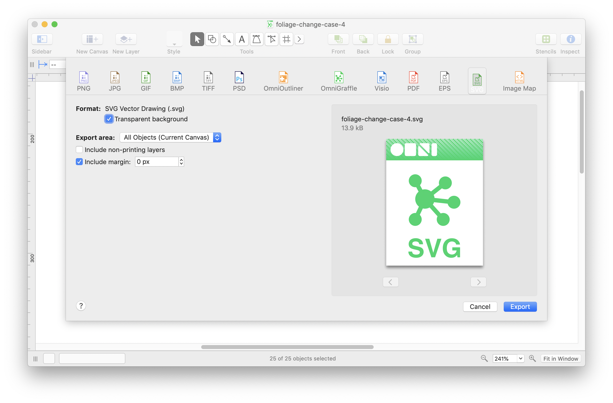

# Foliage diagrams

The diagrams used in the Foliage documentation were created by Michael Hucka in 2022, using OmniGraffle Pro 7.18.5 on a macOS 10.4.6 computer. The SVG versions were produced using the following steps:



1. Export from OmniGraffle to SVG format, using the options "transparent background" and `0`inch margin. (See screen image at the right.)
2. Run [svg-buddy](https://github.com/phauer/svg-buddy) on the SVG file produced from step #1. This will embed the fonts used in the SVG file, overcoming a limitation of OmniGraffle's SVG output. The following is an example of the command used:
    ```sh
    java -jar svg-buddy.jar foliage-change-case-1.svg
    ```
