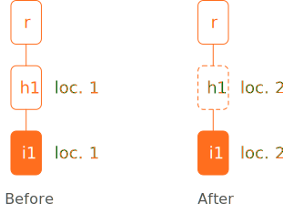
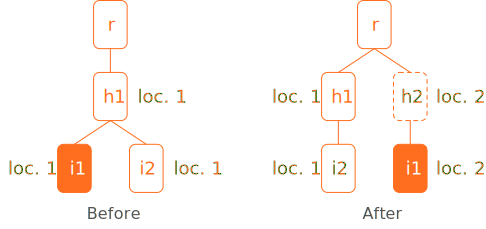
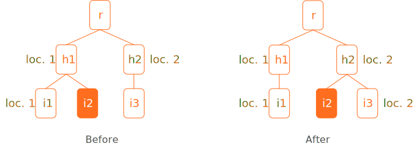
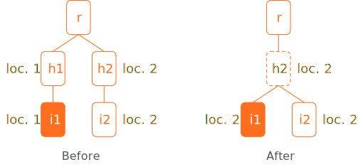

# Nitty-gritty details

This section delves into some topics in more detail.

## Looking up records

In the _Look up records_ tab, you can search for records by simply typing any kind of identifier into the search box. You can also start with one kind of record identifier (e.g., item records) and as Foliage to look up a different kind of record (e.g., loans) by starting with one kind of identifier and telling Foliage to follow the chain of references to get a different kind of record. Depending on what exactly you want to do, some of these operations can be slower than others.

### Identifying the identifiers

The first thing Foliage has to do with identifiers in the _Look up records_ tab is to infer the kind of identifiers that you have typed into the window. Unfortunately, the way that FOLIO itself works prevents Foliage from doing this in a simple way: there is no single FOLIO [API](glossary.html#API) endpoint where you can ask "what kind of record does this identifier belong to?". Foliage has to resort to using a combination of pattern recognition and one-by-one questioning to get an answer. This makes some lookups slower than others.

Here is the sequence of tests that Foliage performs on every identifier typed into the lookup box. It stops as soon as it finds an answer:

1. If it's an integer with length > 7 and starts with `350`, it's an item barcode.
2. If it starts with `it` and the 3rd character is a number, it's an item record [HRID](glossary.html#HRID).
3. If it starts with `ho` and the 3rd character is a number, it's a holdings record [HRID](glossary.html#HRID).
4. If it starts with `clc.`, it's an instance record accession number.
5. Does it contain a dash (`-`)?
   * _Yes_:, it's a unique identifier of some kind, but it's impossible to tell what kind by simply looking at the identifier. Foliage has to contact each of the following FOLIO subsystems  (which requires a separate network [API](glossary.html#API) call) to ask whether it recognizes the unique identifier:
      1. item storage: is this an item record id?
      2. instance storage: is this an instance record id?
      3. holdings storage: is this a holdings record id?
      4. loan storage: is this a loan record id?
      5. user storage: is this a user id?
   * _No_: the identifier is ambiguous (e.g., something like `634546`) and could be either an [HRID](glossary.html#HRID) of a kind that doesn't follow the usual pattern, or else a user barcode. Similar to the "yes" case, Foliage has to make separate [API](glossary.html#API) calls to ask different FOLIO subsystems, one after another, if any recognizes the identifier:
      1. user storage: is this a user barcode?
      2. instance storage: is this an instance record [HRID](glossary.html#HRID)?
      3. item storage: is this an item record [HRID](glossary.html#HRID)?
      4. holdings storage: is this a holdings record [HRID](glossary.html#HRID)?
6. If none of the above succeeds, then Foliage reports the identifier as being unrecognized.

The above hopefully explains why some lookups are slower than others. The worst-case scenario is [HRID](glossary.html#HRID) that belong to user records; then, Foliage has to make a total of 5 [API](glossary.html#API) calls to determine the identifier kind (first asking, and failing, for item, instance, holdings, and loan, before getting a positive answer for user).

Note that the order in which the calls are made is arbitrary and based on guessing what Foliage users might look up most often. The order can be changed, but at present, the tests are done in sequence, so changing the order will simply make some _other_ kind of record slower to identify.

### One record leads to another

The _Look up records_ tab allows you to find a chosen kind of record by starting with a _different_ kind of record identifier. An example of this is starting with an item identifier and getting back loan records for loans involving that item. To achieve this, Foliage sometimes has to do multiple steps, to follow the chain of references between records in FOLIO. Here is a rough summary of how many steps (and thus how slow) different kinds of operations are. Keep in mind that Foliage first has to figure out what kind of identifier it has been given (as discussed in the previous section), so the following steps occur _after_ &ndash; and in addition to &ndash; any [API](glossary.html#API) calls needed for that.

1. Direct lookups of the same kind of identifier (e.g., item records given item identifiers) are fastest and need only a single [API](glossary.html#API) call.
2. FOLIO item records point to holdings records, and holdings records point to instance records. Going between them takes 1 or 2 [API](glossary.html#API) calls, depending on whether FOLIO happens to support a search query for that combination. Not all combinations are covered. For example, getting an instance record given a holdings record id takes 2 [API](glossary.html#API) calls: first Foliage uses the holdings id to retrieve the holdings record (first [API](glossary.html#API) call), reads the instance identifier inside that record, and then retrieves the actual instance record (second [API](glossary.html#API) call).
3. Looking up items, holdings and instances starting from user identifiers can take an unpredictable number of [API](glossary.html#API) calls, based on the number of loans that the user currently has or (if searching for all loans and not only open loans) that the user has _ever_ made. For example, asking for instance records given a user id requires, for every loan, (a) retrieving the loan record to get the identifier of the item loaned, and then  (b) getting the instance record for that item identifier.  Some users have made dozens of loans, so this process can take an extremely long time.

## Changing records

The current implementation of Foliage (version 1.0.x) allows you to change the locations of items and holdings. Changing the location of an item may require behind-the-scenes work to change one or more corresponding holdings record. The following explains the cases that Foliage can handle.

The following convention is used in the diagrams of this section

* Rounded rectangles represent FOLIO records.
* A filled-in rectangle represents the target of the change operation; dotted rectangles represent records that are changed as a consequence of performing the operation.
* A name beginning with **r** represents an instance record, **h** represents a holdings record, and **i** represents an item record.

### Case 1: instance record with only one item in one location

The simplest case of moving an item is when an instance record has one item in one location, and no other items. To move the item to another location, the item's location field value needs to be changed and since there are no other items, the holdings record's location field can simply be changed directly; no new holdings record need to be created and none deleted.

<figure>
    
    <figcaption>Illustration of changes to the hierarchical relationships of records for case 1.</figcaption>
</figure>

### Case 2: instance record with two items in one location

Suppose an instance has two items in the same location, and we want to move one of the items to a new location. The changes needed are as follows: a new holdings record needs to be created to represent the new location; the item's holdings record reference needs to be changed to point to this new holdings record, and the item's location value also needs to be changed to the new location.

<figure>
    
    <figcaption>Illustration of changes to the hierarchical relationships of records for case 2.</figcaption>
</figure>

### Case 3: moving an item between existing locations

Suppose an instance has 3 items – two in one location, a third in another. We move one of the items from one location to the other. Changes needed: item 2's location is changed from location 1 to location 2, and its holdings record reference is changed from **h1** to **h2**. No other changes needed. 

<figure>
    
    <figcaption>Illustration of changes to the hierarchical relationships of records for case 3.</figcaption>
</figure>

### Case 4: moving the last item a given location to another location

Suppose an instance has items in two different locations, and we move one of the items between the locations. Suppose the original location has no other items in it. The move leaves the original location without any items. Changes needed: item 1's location is changed to the new location and its holdings record reference is changed to the other holdings record (**h2**). Since holdings record **h1** no longer has any items attached to it, we delete that holdings record.

<figure>
    
    <figcaption>Illustration of changes to the hierarchical relationships of records for case 4.</figcaption>
</figure>
