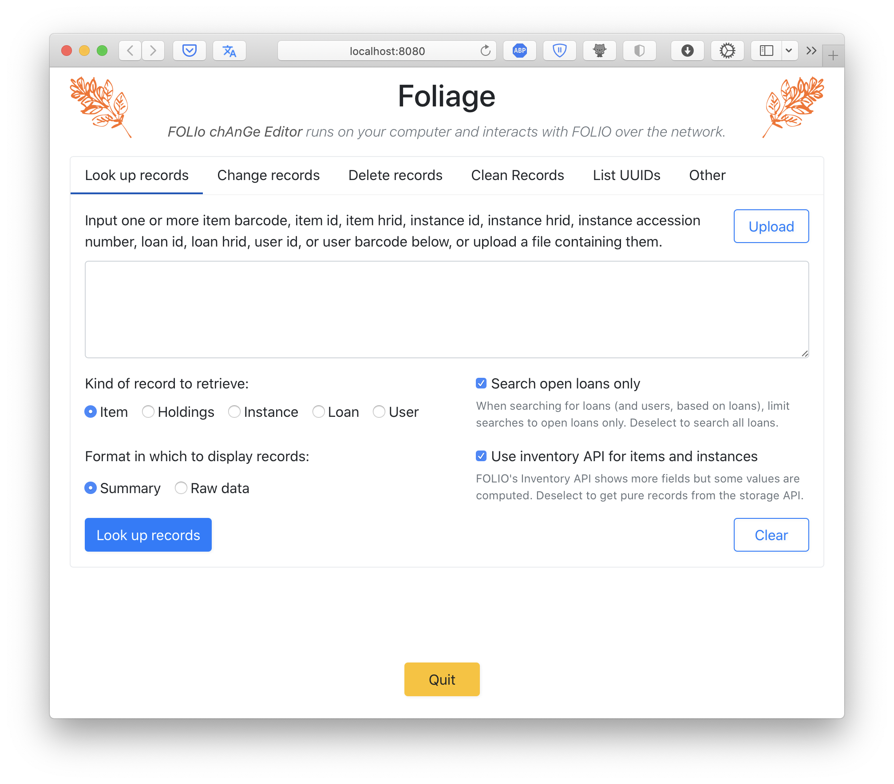
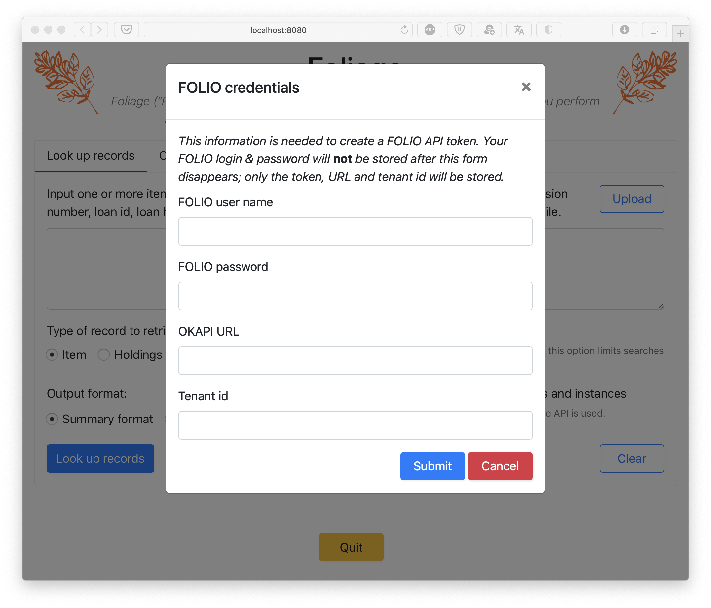
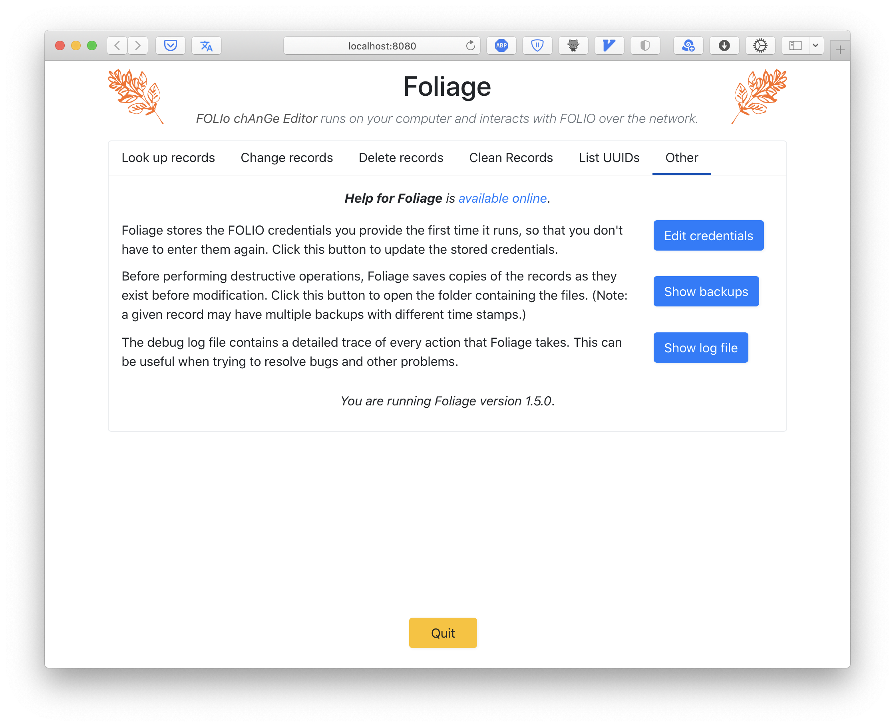
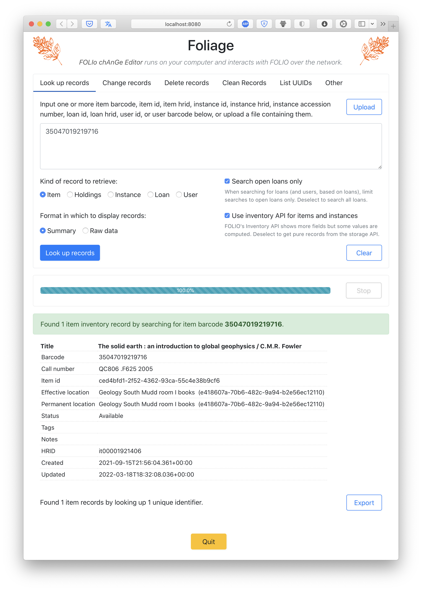

# Using Foliage

This page describe how Foliage works and the functionality presented in the user interface.


## Starting the program

There are multiple ways of starting Foliage. One way is to double-click the program icon in the Windows Explorer or macOS Finder; another way is to start it like you would any other Python program on your computer. If you run Foliage as a command-line program, it offers some additional options to control its behavior. You can find out what they are by running Foliage with the `help` option, which will make it print a summary:

```sh
foliage help
```


## The form of the interface

Although Foliage is a desktop application and not a web service, it uses a web page as its user interface &ndash; it opens a page in a browser on your computer, letting you interact with the program through the familiar elements of a web page. All the while, Foliage runs locally on your computer. When you start Foliage normally (or after it shows the one-time credentials screen, described below), your browser should present a page that looks like the one below:

<figure>
    
</figure>

The interface is organized into five areas of functionality accessed by clicking on the row of tabs near the top: (1) _Look up records_ (the first one shown when Foliage starts up), (2) _Change records_, (3) _Delete records_, (4) _List UUIDs_, and (5) _Other_. They are described in detail below.

Although uncommon, this style of user interface means that Foliage looks and behaves identically no matter whether it is running on Window, macOS, or Linux. It also means the elements of the user interface (buttons, tabs, scroll bars) will all be very familiar to anyone who has interacted with a modern web page.


## Authentication

Before you can do anything in Foliage, the program will need to ask the FOLIO server for a _token_ (a secret key) that Foliage will use to authenticate itself every time it communicates with the server. To get the token, Foliage needs to ask you for some basic information. It does this with a short form that it presents the first time it is run on a new computer:

<figure>
    
</figure>

Foliage needs four pieces of information to connect and authenticate itself to a FOLIO server: a user account name and password, the URL for the FOLIO server, and the tenant id for the FOLIO server. The user name and password must belong to a valid account in FOLIO and are unique to each user; the URL and tenant id are the same for all users at an institution, and need to be obtained from the institute's contacts at FOLIO.

Foliage **does not store** your user name and password. It uses them temporarily in the process of asking FOLIO for a token, but once it has the token, it stores _that_ (along with the URL and tenant id) in the secure password management system on the computer.

Once Foliage has stored the token, subsequent start-ups of Foliage will retrieve it from the secure password management system and will not ask you for the credentials again. If something happens and you need to change the credentials or regenerate the token, you can do so by going to the "Other" tab in Foliage and clicking the <span class="button color-primary">Edit credentials</span> button.

<figure>
    
</figure>


## Tab: look up records

The first tab &ndash; the one presented by Foliage when you start it up &ndash; provides a facility for looking up any item, instance, holdings, loan, or user record using any of the common identifiers by which the records can be addressed.  Depending on the type of record, this may be a barcode, a unique id (i.e., a string that looks like `f6fac97a-ee31-4300-aef6-b63be4ea23a2`), an "hrid" (human readable identifier), or an accession number. You can either type or paste the numbers into the text box on the page, or use the <span class="button color-outline-primary">Upload</span> button to upload a text file containing such identifiers. Identifiers can be separated by newlines, spaces, commas, colons, or semicolons; Foliage will also strip any quote characters from the input. The screenshot below shows an example of looking up an item by its barcode:

<figure>
    
</figure>

Under the input text box, there are four control elements that influence what Foliage does.

* _Kind of record to retrieve_: The five radio boxes allow you to select the kind of record to retrieve based on the identifiers given. One of Foliage's powerful features is that it lets you use one kind of record identifier to search for _other_ kinds of records. For example, you can supply item barcodes and select _Instance_ as the type of record to retrieve, and Foliage will retrieve the instance records for the given identifiers. Or you can select _Loan_ as the type to retrieve and find out if there are any loans out for the given items. To take another example, you could provide a user identifier, select _Item_ as the kind of record to retrieve, and get back a list of the items on loan to the user.
* _Search open loans only_: When searching for loans, Foliage can be told to consider only open loans, or all loans. You can use this checkbox to choose what Foliage should do. Use this option with caution: unchecking this will cause Foliage to retrieve any loans, including closed loans from the history of loans for every item in the input, which could potentially be a long list and take a very long time to retrieve.
* _Output format_: Foliage can present the output either in a summary format or in the raw data format retrieved from the FOLIO server. The summary format is a custom tabular format that shows a subset of the fields from each record. Different record kinds are presented with different fields in the output.
* _Use inventory API for items and instances_: Items and instances in FOLIO come in two slightly different record formats, depending on which one of two FOLIO APIs are used to retrieve them. The so-called "inventory" API returns results that have slightly more data compared to the so-called "storage" API. The additional fields are computed by FOLIO and are not actually stored with the records. The additional information can be useful when exploring items and instances, but because the inventory API does not represent what is actually stored by FOLIO, it is better to deselect this option and make Foliage use the storage API if you are working with records for the purpose of changing field values or performing other actions.


## Tab: change records

## Tab: delete records

## Tab: list UUIDs

## Tab: other

The _Other_ tab has already been mentioned above in the section on [Authentication](#authentication). On this tab, Foliage provides three buttons, shown in the screenshot below:

<figure>
    
</figure>

* The <span class="button color-primary">Edit credentials</span> button allows you to edit the credentials used by Foliage for interacting with the FOLIO server. This includes the user name and password for FOLIO, the URL for the FOLIO server, and the tenant id. As mentioned in the [section on authentication](#authentication), Foliage does not store your user name and password, so when you click this button to edit the credentials, those fields will be blank and you will have to enter them again.
* The <span class="button color-primary">Show backups</span> button opens a Windows Explorer or macOS Finder window (depending on your operating system) on the folder where Foliage writes backups of every record it changes or deletes before it makes any change to the record. The backups are organized by the unique identifier of the record in question; within each subfolder, you will find a file named after the time the backup was made and containing the raw record data in a format known as [JSON](https://en.wikipedia.org/wiki/JSON). This is a simple backup scheme meant only as a last-ditch safety measure to guard against catastrophic errors. Note: Foliage does not offer a way of restoring records from these backup files. If you need to restore a record using these backups, consult with the FOLIO experts at your institution.
* The <span class="button color-primary">Show log file</span> button displays a log of all the actions taken by Foliage since it was started in the current session. The information is quite detailed and probably not much use to anyone but the developers of Foliage, but they can be useful when trying to investigate program bugs and other problems.

